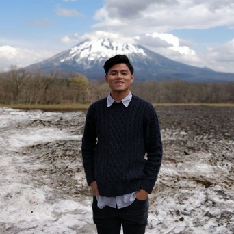

<body data-spy="scroll" data-target="#myNavBar" data-offset="100">
		<!--PROFILE PICTURE-->
		<section id="about" class="container-fluid">
			

				
				

					<h1> Jess Teo </h1>
					<h3>Computer Engineering undergraduate at National University of Singapore</h3>
					<a href="CV.pdf" class="button1"> Download CV </a>
				
	
			

		</section>	
		<!--COMPUTER SKILLS-->
		<section id="skills">
			

			

				<h2>Computer skills</h2>
			

			

				

					

						

							

								<h5>C and C++</h5>
							

						

						

							

								<h5>Java</h5>
							

						

					

							

								<h5>GitHub</h5>
							

						

					

					

						

							

								<h5>HTML</h5>
							

						

						

							

								<h5>CSS</h5>
							

						

						

							

								<h5>Python</h5>
							

						

					

				

			

		</section>
			<!--Work Experience-->
		<section id ="experience">
			

				

				

					<h2> Work experience </h2>
				

				<ul class="timeline">
					<li>
						

						

							

								

										<h3>CitiBank</h3>
										<h4>Summer Technology Analyst</h4>
										
<small class="fa fa-clock-o"></small> Jun 2020 - Aug 2020

								

								

									<ul>
										<li>
											
Guided students in weekly lab Built an interactive dashboard using PowerBI to develop insights about real-world financial data.

										</li>
										<li>
											
Developed a web-application using Python-Flask that was hosted using Docker.

										<li>

Designed a Chatbot using AWS lex and lamda to handle client’s queries.

										</li>
									</ul>
								

							

						 

					</li>
					<li>
						

						

							

								

										<h3>National University of Singapore</h3>
										<h4>Teaching Assistant</h4>
										
<small class="fa fa-clock-o"></small> Aug 2019 - May 2020

								

								

									<ul>
										<li>
											
Guided students in weekly lab work and gave consultations to students who needed help

										</li>
									</ul>
								

							

						 

					</li>
					<li>
						

						

							

								

									<h3>Thatz International Pte Ltd</h3>
									<h4>Intern, Software Engineer</h4>
									
<small class="fa fa-clock-o"></small> May 2019 - Aug 2019

								

								

									<ul>
										<li>
											
Designed front-end web application using HTML

											
Integrated external login services like Facebook and LinkedIn into the server

										</li>
										<li>
											
Incorporated payment services like Paypal and Stripe into the application

											
Assisted in writing unit test for the web application

                    </li>
									</ul>
								

							

						

					</li>
          <li>
						

						

							

								

									<h3>Procoil Engineering Pte Ltd</h3>
									<h4>Intern, Engineering</h4>
									
<small class="fa fa-clock-o"></small> Feb 2018 - Jul 2018

								

								

									<ul>
										<li>
											
Assisted in writing and testing of software for reeling machines using Programmable Logic Controllers (PLCs)

											
Assembled reeling machineries which was essential for core business

										</li>
										<li>
											
Converted 2D drawings into 3D using SolidWorks which help speed up assembly process by providing a clearer overview

                    </li>
									</ul>
								

							

						

					</li>
          <li>
						

						

							

								

									<h3>Republic of Singapore Air Force</h3>
									<h4>Lieutenant, 606 Squadron</h4>
									
<small class="fa fa-clock-o"></small> Feb 2018 - Jul 2018

								

								

									<ul>
										<li>
											
Spearheaded real time operations in protecting the air base from conventional threats

											
Led in the planning and facilitation of training and fitness regimes which was essential for daily operations

										</li>
										<li>
											
Presented post-operation briefs to air base commanders after emergency deployments

                    </li>
									</ul>
								

							

						

					</li>
				</ul>
			

		</section>
		<!--Co-Curricullar Experience-->
		<section id = "Co-Curricullar Experience">
			

			

				<h2>Co-Curricular Experience</h2>
			

			

				<ol class="carousel-indicators">
					<li data-target="#myCarousel" data-slide-to="0" class="active"></li>
					<li data-target="#myCarousel" data-slide-to="1"></li>
				</ol>
				

					

						<h3>NUS Fintech Society</h3>
						<h4>Developed a Fraud Detection Analysis model</h4>
					

					

						<h3>Basketball</h3>
						<h4>Captain, Kent Ridge Hall</h4>
            <h4>Won first in the Inter-Faculty Games in 2018 and 2019</h4>
					

				

				<a class="carousel-control-prev" href="#myCarousel" data-slide="prev" role="button"> </a>
				<a class="carousel-control-next " href="#myCarousel" data-slide="next" role="button"> </a>
			

		</section>
		<!--Hackathons-->
		<section id ="Hackathons">
			

				

				

				<h2>Hackathons</h2>
			

			

				

					

						

              <h5>2019</h5>
							<h3>Circles.Hack</h3>
							<h4>Finalist</h4>
							

							
 8-day virtual hackathon

							
Created a fun and smart digital personal finance management system based on spending behaviour

						

					

					

						

							<h5>2019</h5>
							<h3>DSTA Brain Hack</h3>
							

							
Attended Today I Learned AI camp organised by DSTA

              
Created an image classification model using Machine Learning and Deep Learning

						

					

          

						

							<h5>2018</h5>
							<h3>National Data Science Challenge 2018</h3>
							

              
Created a classification model to determine the category given the image and title

						

					

				

			

		</section>
		<footer class="text-center">
			<a href="#about">
				
			</a>
			<!--<h5>
				© Copyright APPRENDRE-A-CODER.COM
			</h5>-->
		</footer>
</body>
